# Cyber Policy Analysis Pipeline — Complete Technical Breakdown

**Rhône Risk Advisory** | Prepared February 2026 | Architecture & Implementation Guide

---

## Table of Contents

1. [System Architecture Overview](#1-system-architecture-overview)
2. [The Upload-to-Report Pipeline (End-to-End)](#2-the-upload-to-report-pipeline-end-to-end)
3. [Service 1 — CRM Frontend (Vercel / Next.js)](#3-service-1--crm-frontend-vercel--nextjs)
4. [Service 2 — Supabase (Database + File Storage)](#4-service-2--supabase-database--file-storage)
5. [Service 3 — Railway Analysis API (FastAPI / Python)](#5-service-3--railway-analysis-api-fastapi--python)
6. [Two-Phase Claude AI Analysis](#6-two-phase-claude-ai-analysis)
7. [Scoring Methodology — How Policies Are Graded](#7-scoring-methodology--how-policies-are-graded)
8. [The 14 Coverage Categories](#8-the-14-coverage-categories)
9. [Report Generation — The Final PDF](#9-report-generation--the-final-pdf)
10. [Security & Authentication](#10-security--authentication)
11. [7 Critical Gaps & Their Solutions](#11-7-critical-gaps--their-solutions)
12. [Deployment Strategy — Phased Rollout](#12-deployment-strategy--phased-rollout)
13. [File Map — Every File and Its Purpose](#13-file-map--every-file-and-its-purpose)

---

## 1. System Architecture Overview

The Rhône Risk Cyber Policy Analysis Pipeline is built on **three independent services** that communicate over HTTPS. Each service has a specific job, and together they form an automated pipeline that transforms a raw insurance policy PDF into a scored, branded due-diligence report.

### The Three Services at a Glance

| Service | Platform | Technology | Primary Job |
|---------|----------|------------|-------------|
| **CRM Frontend** | Vercel | Next.js 14, TypeScript, React | User interface, upload handling, triggering analysis, displaying results |
| **Database + Storage** | Supabase | PostgreSQL, S3-compatible storage | Stores policy records, PDF files, and analysis results |
| **Analysis API** | Railway | FastAPI, Python, pdfplumber, reportlab | Receives webhooks, extracts PDFs, runs AI analysis, generates reports |

> **🍎 Explain Like I'm in 2nd Grade**
>
> Imagine you're making a peanut butter and jelly sandwich, but three different friends are helping you.
>
> **Friend 1 (the CRM)** is the one who takes your bread out of the bag and puts it on the table. They're the "front person" who you talk to and who makes everything look nice.
>
> **Friend 2 (Supabase)** is like your lunchbox. They hold the bread, the peanut butter jar, and the jelly jar — they keep everything stored and safe. When Friend 1 needs something, they ask Friend 2 for it.
>
> **Friend 3 (Railway)** is the friend who actually makes the sandwich. They take the bread, spread the peanut butter, add the jelly, and cut it into a nice triangle. They're the one doing all the real work.
>
> There's also a **really smart robot (Claude AI)** that Friend 3 calls to figure out exactly how much peanut butter and jelly to use — like a recipe expert!

---

## 2. The Upload-to-Report Pipeline (End-to-End)

This is the complete journey of a policy document — from the moment a user uploads a PDF to the moment they see the analysis score and can download the report. The entire process takes approximately 1–3 minutes.

```mermaid
sequenceDiagram
    actor User
    participant CRM as CRM Frontend<br/>(Vercel)
    participant DB as Supabase DB
    participant Store as Supabase Storage
    participant API as Analysis API<br/>(Railway)
    participant Haiku as Claude Haiku<br/>(Phase 1)
    participant Sonnet as Claude Sonnet<br/>(Phase 2)

    Note over User,Sonnet: STAGE 1 — Upload & Trigger

    User->>CRM: Click "Add Policy" + attach PDF
    CRM->>Store: Upload PDF to insurance-policies bucket
    Store-->>CRM: storage_path confirmed
    CRM->>DB: INSERT into insurance_policies (status: NULL)
    CRM->>CRM: Client-side JS fires auto-analyze POST

    Note over User,Sonnet: STAGE 2 — Dispatch to Railway

    CRM->>DB: SELECT policy + company details
    CRM->>Store: Request signed URL (1 hour)
    Store-->>CRM: Signed URL returned
    CRM->>DB: UPDATE status → "processing"
    CRM->>API: POST /webhook/policy-uploaded (HMAC-signed payload)
    API-->>CRM: 200 OK + analysis_id
    CRM->>DB: UPDATE analysis_id, status → "analyzing"

    Note over User,Sonnet: STAGE 3 — Analysis Pipeline (Background)

    API->>Store: Download PDF via signed URL
    API->>API: pdfplumber: Extract text from PDF
    API->>Haiku: Phase 1 — Extract structured data
    Haiku-->>API: Structured markdown extraction
    API->>Sonnet: Phase 2 — Score with methodology
    Sonnet-->>API: Full YAML analysis with scores
    API->>API: Parse YAML → Enrich → Validate
    API->>API: reportlab: Generate branded PDF report

    Note over User,Sonnet: STAGE 4 — Callback & Display

    API->>CRM: POST /webhook/analysis-complete (results)
    CRM->>DB: UPDATE score, recommendation, status → "completed"
    CRM-->>User: UI refreshes with score badge + download button
```

### Pipeline Stages Breakdown

| Stage | Duration | What Happens | Where |
|-------|----------|--------------|-------|
| **1. Upload & Trigger** | ~2-5 sec | PDF stored, DB record created, analysis triggered | Vercel + Supabase |
| **2. Dispatch** | ~1-3 sec | Signed URL created, payload sent to Railway | Vercel → Railway |
| **3a. Extraction** | ~5-15 sec | PDF downloaded and text extracted with pdfplumber | Railway |
| **3b. Phase 1** | ~10-20 sec | Haiku extracts structured data from raw text | Railway → Claude Haiku |
| **3c. Phase 2** | ~30-90 sec | Sonnet scores every coverage item using methodology | Railway → Claude Sonnet |
| **3d. Report Gen** | ~3-8 sec | Branded PDF report created with reportlab | Railway |
| **4. Callback** | ~1-2 sec | Results sent back to CRM and stored in database | Railway → Vercel → Supabase |

> **🍎 Explain Like I'm in 2nd Grade**
>
> Think of it like sending a letter through the mail, but super fast!
>
> **Step 1:** You put a paper (the insurance document) into a mailbox (upload to the website).
>
> **Step 2:** The mailman (the website) picks it up and sends it to a smart helper at a special office (Railway).
>
> **Step 3:** The smart helper reads every single word on the paper, then asks two robot brains to think about it. The first robot brain (Haiku) writes down all the important facts. The second robot brain (Sonnet) looks at those facts and gives the paper a report card grade.
>
> **Step 4:** The helper writes a beautiful report with the grade on it and mails it back to you. When you check the website again — ta-da! — there's your grade and your report!

---

## 3. Service 1 — CRM Frontend (Vercel / Next.js)

The CRM is the user-facing application — the website that brokers and analysts interact with. It's a Next.js application deployed on Vercel that handles everything the user sees and touches: uploading policies, viewing companies, and seeing analysis results.

```mermaid
graph LR
    subgraph "CRM Frontend — Vercel"
        direction TB
        UI["🖥️ React Components\n(insurance-policies-section.tsx)"]
        API1["📡 /api/policies/[id]/analyze\n(route.ts — Trigger)"]
        API2["📡 /api/webhook/analysis-complete\n(route.ts — Receiver)"]
        LIB["🔐 analysis-api.ts\n(HMAC signing, dispatch)"]
    end

    UI -->|"User clicks analyze"| API1
    API1 -->|"Uses"| LIB
    LIB -->|"Sends to Railway"| EXT["Railway API"]
    EXT -->|"Returns results"| API2
    API2 -->|"Updates DB"| DB["Supabase"]
    DB -->|"Realtime"| UI
```

### Key Files

| File | Purpose | Key Functions |
|------|---------|---------------|
| `insurance-policies-section.tsx` | React component showing policies table with upload, auto-trigger, score badges | Renders policy list, auto-fires `POST /api/policies/{id}/analyze` after upload (lines 170-178) |
| `/api/policies/[id]/analyze/route.ts` | API route that triggers analysis for a specific policy | `POST`: Fetches policy, creates signed URL, updates status, dispatches to Railway. `GET`: Returns current analysis status |
| `/api/webhook/analysis-complete/route.ts` | Webhook receiver — Railway calls this when analysis finishes | Verifies HMAC signature, parses result, updates `insurance_policies` record with score + recommendation |
| `analysis-api.ts` | Shared library for Railway API communication | `generateSignature()`: Creates HMAC-SHA256 signatures. `verifySignature()`: Validates incoming signatures. `dispatchPolicyAnalysis()`: Sends webhook to Railway |

### How the Trigger Works (Currently)

```mermaid
flowchart TD
    A["User uploads PDF\nin CRM UI"] --> B["File uploaded to\nSupabase Storage"]
    B --> C["Record inserted in\ninsurance_policies table"]
    C --> D{"Client-side JS\nauto-fires POST"}
    D -->|"Success"| E["POST /api/policies/{id}/analyze"]
    D -->|"Browser closes\nor network fails"| F["❌ Analysis never\ntriggered — SILENT FAILURE"]
    E --> G["CRM fetches policy\ndetails from Supabase"]
    G --> H["CRM creates 1-hour\nsigned URL for PDF"]
    H --> I["CRM sends HMAC-signed\nwebhook to Railway"]
    I --> J["Railway returns\nanalysis_id"]
    J --> K["CRM updates DB:\nstatus → analyzing"]
```

> **🍎 Explain Like I'm in 2nd Grade**
>
> The CRM is like the **front desk at a doctor's office**.
>
> When you walk in (open the website), the front desk person greets you and lets you fill out your paperwork (upload your insurance document).
>
> Once you hand in your paperwork, the front desk person puts a copy in the filing cabinet (Supabase) and sends the original to the doctor's office in the back (Railway) for the actual checkup.
>
> When the doctor is done, they send their report back to the front desk, and the front desk person calls you to say "Your results are ready!" and shows you your health score on a screen.

---

## 4. Service 2 — Supabase (Database + File Storage)

Supabase is the backbone data layer — a managed PostgreSQL database with built-in file storage. It holds every policy record, every PDF file, and every analysis result. Both the CRM and the Railway API read from and write to Supabase.

### Two Storage Buckets

| Bucket | Purpose | Access | Status |
|--------|---------|--------|--------|
| `insurance-policies` | Stores uploaded policy PDF files | Private — accessed via signed URLs | ✅ Exists |
| `reports` | Stores generated analysis report PDFs | Private — needs RLS policy for service role | ❌ Needs creation |

### Key Database Columns on `insurance_policies`

| Column | Type | Purpose |
|--------|------|---------|
| `storage_path` | TEXT | Path to the uploaded PDF in Supabase Storage |
| `analysis_id` | TEXT | Unique ID returned by Railway when analysis starts |
| `analysis_status` | TEXT | Current state: NULL → processing → analyzing → completed/failed |
| `analysis_score` | FLOAT | Overall maturity score (0-10 scale) |
| `analysis_recommendation` | TEXT | BIND, BIND WITH CONDITIONS, NEGOTIATE, or DECLINE |
| `analysis_data` | JSONB | Full structured analysis (all sections, scores, red flags) |
| `report_storage_path` | TEXT | Path to the generated report PDF in Supabase (NEW — needs migration) |

### Analysis Status State Machine

> **🍎 Explain Like I'm in 2nd Grade**
>
> Supabase is like your **school's filing cabinet and locker room combined**.
>
> The **filing cabinet** (database) has a folder for every student (policy). Each folder has all the important info written on it — the student's name, their grade, their teacher's notes.
>
> The **locker room** (storage) is where the actual big things are kept — like the student's art projects (PDF files). You can't just walk in and grab one; you need a special hall pass (signed URL) that only works for one hour.
>
> When the report card comes back from the teacher, the front desk writes the grade on the folder AND puts the actual report card in the locker. That way everything is in one place!

---

## 5. Service 3 — Railway Analysis API (FastAPI / Python)

The Railway API is the brain of the operation. It receives webhooks from the CRM, downloads policy PDFs, extracts text, sends the text to Claude for AI analysis, generates a branded PDF report, and calls back the CRM with results. Everything from step 3 in the pipeline happens here.

```mermaid
graph TB
    subgraph "Railway Analysis API"
        direction TB
        WH["🔌 webhook.py\nPOST /webhook/policy-uploaded"]
        ORC["🎯 orchestrator.py\nrun_policy_analysis()"]

        subgraph "Step 1: Extract"
            PDF["📄 pdf_extractor.py\npdfplumber extraction"]
        end

        subgraph "Step 2: Analyze"
            CA["🧠 claude_analyzer.py\nTwo-phase or single-pass"]
            SP["📝 system_prompt.py\n8 modular components"]
        end

        subgraph "Step 3: Report"
            RG["📊 report_generator.py\nreportlab branded PDF"]
        end

        CB["📤 Callback sender\nPOST to CRM webhook"]
    end

    WH -->|"Queues background task"| ORC
    ORC --> PDF
    PDF -->|"Extracted text"| CA
    SP -->|"Prompt assembly"| CA
    CA -->|"YAML analysis data"| RG
    RG -->|"PDF report"| CB
```

### Orchestrator Pipeline (orchestrator.py)

The orchestrator is the conductor of the entire analysis. It coordinates four steps in sequence:

```mermaid
flowchart LR
    A["📥 STEP 1\nDownload &\nExtract PDF"] --> B["🧠 STEP 2\nClaude AI\nAnalysis"]
    B --> C["📄 STEP 3\nGenerate\nPDF Report"]
    C --> D["📤 STEP 4\nSend\nCallback"]

    A -->|"ExtractionResult\n(text, pages, tables)"| B
    B -->|"AnalysisResult\n(YAML scores)"| C
    C -->|"ReportResult\n(PDF path)"| D
```

### Key Files

| File | Purpose | Key Functions |
|------|---------|---------------|
| `webhook.py` | FastAPI router — receives the CRM webhook | `handle_policy_uploaded()`: Validates payload, generates analysis_id, queues background task. `verify_signature()`: HMAC-SHA256 verification (defined but NOT currently enforced) |
| `orchestrator.py` | Main pipeline coordinator | `run_policy_analysis()`: Runs Steps 1-4 sequentially, handles errors, sends callback. `analysis_status_store`: In-memory dict tracking job status (⚠️ lost on restart) |
| `pdf_extractor.py` | Extracts text from PDF using pdfplumber | `extract_from_url()`: Downloads PDF then extracts. `extract_from_file()`: Extracts text + tables with page markers |
| `claude_analyzer.py` | Two-phase AI analysis engine | `analyze_policy_two_phase()`: Phase 1 (Haiku) + Phase 2 (Sonnet). `analyze_policy()`: Single-pass fallback. `_parse_yaml_or_json()`: 5-layer output parser |
| `system_prompt.py` | Modular prompt assembly (1186 lines) | `get_extraction_prompt()`: Phase 1 prompt. `get_analysis_prompt()`: Phase 2 prompt. `get_full_analysis_prompt()`: Single-pass with example |
| `report_generator.py` | Branded PDF generation with reportlab | `generate_report()`: Cover page, executive summary, coverage tables, red flags, recommendations |
| `config.py` | Environment-based configuration | API keys, model selection, feature flags (USE_TWO_PHASE), branding colors |

### Configuration Settings

| Setting | Default Value | Purpose |
|---------|---------------|---------|
| `CLAUDE_MODEL` | claude-sonnet-4-20250514 | Model for Phase 2 (deep analysis) |
| `EXTRACTION_MODEL` | claude-haiku-4-5-20251001 | Model for Phase 1 (fast extraction) |
| `CLAUDE_MAX_TOKENS` | 16384 | Max output tokens for analysis |
| `USE_TWO_PHASE` | True | Use two-phase pipeline (recommended) |
| `PRIMARY_COLOR` | #162B4D | Rhône Risk navy blue for reports |
| `ACCENT_COLOR` | #0CBDDB | Rhône Risk cyan/teal for reports |

> **🍎 Explain Like I'm in 2nd Grade**
>
> The Railway API is like the **kitchen in a restaurant**.
>
> When you order food (the CRM sends a request), the order goes to the kitchen. The **head chef (orchestrator)** reads the order and tells everyone what to do.
>
> First, the **prep cook (PDF extractor)** washes and chops all the vegetables — that's like reading all the words out of the insurance document.
>
> Then, the **sous chef (Claude AI)** takes those chopped vegetables and cooks them into a beautiful dish — that's the AI figuring out what the insurance policy actually means and giving it a grade.
>
> Finally, the **plating team (report generator)** arranges everything on a pretty plate — that's creating the fancy PDF report with the Rhône Risk logo and colors.
>
> When it's all done, a waiter carries it back out to you!

---

## 6. Two-Phase Claude AI Analysis

The most sophisticated component is the AI analysis pipeline. Instead of asking a single AI model to read the raw PDF text AND score it in one shot, we split the work into two specialized phases — each using a different AI model optimized for its task.

```mermaid
graph TB
    subgraph "📥 Input"
        RAW["Raw PDF Text\n(page markers, tables,\nunstructured text)"]
    end

    subgraph "🔵 Phase 1 — Data Extraction (Claude Haiku)"
        direction TB
        P1_PROMPT["get_extraction_prompt()\n6-section extraction template"]
        P1_MODEL["claude-haiku-4-5-20251001\nFast & cost-efficient\n8,192 max tokens"]
        P1_OUT["Structured Markdown\n• Declarations data\n• Insuring agreements\n• Definitions\n• Exclusions\n• Conditions\n• Schedule of forms"]
    end

    subgraph "🟠 Phase 2 — Scoring & Analysis (Claude Sonnet)"
        direction TB
        P2_PROMPT["get_analysis_prompt()\n8 modular components"]
        P2_MODEL["claude-sonnet-4-20250514\nDeep analytical reasoning\n16,384 max tokens"]
        P2_OUT["Full YAML Analysis\n• 14 category scores\n• 5-dimension maturity\n• Red flags\n• Recommendations\n• Executive summary"]
    end

    subgraph "✅ Post-Processing"
        PARSE["_parse_yaml_or_json()\n5-layer fallback parser"]
        ENRICH["_enrich_analysis()\nCompute weighted scores,\nadd metadata"]
        VALIDATE["_validate_analysis()\nCheck completeness:\nsections, scores, flags"]
    end

    RAW --> P1_PROMPT
    P1_PROMPT --> P1_MODEL --> P1_OUT
    P1_OUT --> P2_PROMPT
    P2_PROMPT --> P2_MODEL --> P2_OUT
    P2_OUT --> PARSE --> ENRICH --> VALIDATE
```

### Why Two Phases Instead of One?

| Aspect | Single-Pass | Two-Phase |
|--------|-------------|-----------|
| **Quality** | Good — model juggles extraction + analysis simultaneously | Better — each model focuses on one task at full capacity |
| **Cost** | One Sonnet call (~$0.15-0.25) | One Haiku call (~$0.01) + one Sonnet call (~$0.15-0.25). Haiku is nearly free. |
| **Speed** | ~45-120 sec total | ~60-130 sec total (slightly longer) |
| **Reliability** | If parsing fails, everything fails | Phase 1 output can be inspected independently; Phase 2 works from clean data |
| **Debugging** | Hard to tell if error is in extraction or analysis | Easy — check Phase 1 output to isolate where things went wrong |

### The 5-Layer Output Parser

Claude's output is requested as YAML, but the parser handles many edge cases with a cascading fallback strategy:

```mermaid
flowchart TD
    A["Claude's Raw Output"] --> B{"Try YAML\nparsing"}
    B -->|"✅ Valid YAML"| Z["Return parsed dict"]
    B -->|"❌ Failed"| C{"Try JSON\nparsing"}
    C -->|"✅ Valid JSON"| Z
    C -->|"❌ Failed"| D{"Extract from\nyaml code block"}
    D -->|"✅ Found + valid"| Z
    D -->|"❌ Failed"| E{"Extract from\njson code block"}
    E -->|"✅ Found + valid"| Z
    E -->|"❌ Failed"| F{"Find any\n{...} object"}
    F -->|"✅ Found + valid"| Z
    F -->|"❌ Failed"| G["Return error dict\nwith raw output preserved"]
```

> **🍎 Explain Like I'm in 2nd Grade**
>
> Imagine you have to do a book report. Instead of trying to read the book AND write the report at the same time (which is really hard!), you break it into two steps.
>
> **Step 1 (the fast reader — Haiku):** First, a really fast reader goes through the book and writes down all the important facts on sticky notes. "The main character is named Bob. The story takes place in a castle. There are three dragons." They don't judge anything — they just collect information.
>
> **Step 2 (the smart thinker — Sonnet):** Then, a really smart thinker reads all the sticky notes and writes the actual report. "This was a great book because the dragons were exciting. The castle was spooky and added tension. I give it an 8 out of 10."
>
> The fast reader is cheap (almost free!) and good at finding facts quickly. The smart thinker is more expensive but amazing at thinking deeply about what things mean. Together, they make a much better report than either one could alone!

---

## 7. Scoring Methodology — How Policies Are Graded

Every insurance policy is scored using Rhône Risk's proprietary two-tier methodology: **per-item scoring** (5 factors for each coverage line item) and **overall maturity assessment** (5 weighted dimensions).

### Tier 1: Per-Item 5-Factor Scoring (0-10)

Every individual coverage item (like "Crisis Management Expenses" or "Social Engineering Fraud") receives a score from 0 to 10 based on five factors that sum together:

| Factor | Max Points | What It Measures | Example |
|--------|------------|------------------|---------|
| **Sublimit Adequacy** | 2.0 | Is the dollar amount for this coverage sufficient? | $2M limit on $5M aggregate = 40% → 1.5 points |
| **Scope of Coverage** | 3.0 | How many scenarios are covered? | Covers all types of social engineering including phone fraud → 3.0 points |
| **Exclusions Impact** | 2.0 | Do exclusions meaningfully reduce protection? | Only standard market exclusions → 2.0 points |
| **Prior Acts** | 1.5 | Does coverage extend to past events? | Unlimited retroactive date → 1.5 points |
| **Conditions** | 1.5 | Are there unfair "gotcha" clauses? | Reasonable requirements, no hammer clause → 1.5 points |

### Tier 2: Overall 5-Dimension Maturity Assessment (0-10)

Beyond individual items, the policy as a whole is assessed across five weighted dimensions:

```mermaid
graph LR
    subgraph "Weighted Dimensions"
        D1["🌐 Coverage Breadth\nWeight: 1.5\nHow many categories covered?"]
        D2["📊 Coverage Depth\nWeight: 1.3\nAre limits adequate?"]
        D3["🏗️ Policy Structure\nWeight: 1.0\nTerritory, defense costs, terms"]
        D4["🛡️ Risk Management\nWeight: 1.2\nExclusion severity, conditions"]
        D5["💰 Financial Strength\nWeight: 1.1\nCarrier rating, premium adequacy"]
    end

    D1 --> F["Weighted Average\n= Overall Maturity Score"]
    D2 --> F
    D3 --> F
    D4 --> F
    D5 --> F

    F --> L{Score Range}
    L -->|"8.5-10.0"| L1["🏆 Optimized"]
    L -->|"7.0-8.4"| L2["✅ Managed"]
    L -->|"5.5-6.9"| L3["📋 Defined"]
    L -->|"3.5-5.4"| L4["⚠️ Developing"]
    L -->|"0.0-3.4"| L5["🚨 Initial"]
```

### Final Recommendation Logic

| Recommendation | Score Threshold | Conditions |
|----------------|-----------------|------------|
| **BIND** | ≥ 7.0 | No HIGH severity red flags, meets industry-specific needs |
| **BIND WITH CONDITIONS** | 5.5 – 6.9 | Or minor HIGH flags addressable via endorsement |
| **NEGOTIATE** | 4.0 – 5.4 | Significant gaps requiring carrier negotiation before binding |
| **DECLINE** | < 4.0 | Or unmitigated critical red flags |

> **🍎 Explain Like I'm in 2nd Grade**
>
> Imagine you're a teacher grading a student's homework assignment. The assignment has lots of questions, and you grade each one individually.
>
> **For each question**, you check five things: Did they answer enough of it? (sublimit) Did they cover all the parts? (scope) Did they make any big mistakes? (exclusions) Did they do the bonus problems from last week too? (prior acts) Did they follow all the instructions? (conditions)
>
> Then, you also give an **overall grade** for the whole assignment by looking at the big picture — did they answer most questions? (breadth) Were their answers detailed? (depth) Was it organized neatly? (structure) Did they avoid common mistakes? (risk management) Did they use good references? (financial strength)
>
> Finally, based on the overall grade, you give a final recommendation: "A" means pass with flying colors, "B" means pass but study more, "C" means they need to redo some parts, and "F" means start over!

---

## 8. The 14 Coverage Categories

Every cyber insurance policy is analyzed against a standardized framework of 14 coverage categories — 7 first-party (things that happen to YOU) and 7 third-party (claims from OTHER people against you). Each category has 3-6 sub-items that are individually scored.

```mermaid
graph TB
    subgraph "🔷 First-Party Coverages (7)"
        FP1["1. Breach Response\n& Crisis Management"]
        FP2["2. Business\nInterruption"]
        FP3["3. Data Recovery\n& Restoration"]
        FP4["4. Cyber Extortion\n/ Ransomware"]
        FP5["5. Social Engineering\n/ Funds Transfer Fraud"]
        FP6["6. Reputational\nHarm"]
        FP7["7. System Failure\n(Non-Malicious)"]
    end

    subgraph "🔶 Third-Party Coverages (7)"
        TP1["8. Privacy\nLiability"]
        TP2["9. Network Security\nLiability"]
        TP3["10. Technology\nE&O"]
        TP4["11. Media\nLiability"]
        TP5["12. Regulatory Defense\n& Penalties"]
        TP6["13. PCI-DSS Fines\n& Assessments"]
        TP7["14. Contractual\nLiability"]
    end

    FP1 & FP2 & FP3 & FP4 & FP5 & FP6 & FP7 --> SCORE["Overall\nMaturity Score"]
    TP1 & TP2 & TP3 & TP4 & TP5 & TP6 & TP7 --> SCORE
```

### First-Party = "Things That Happen TO Your Company"

| # | Category | Sub-Items Scored | What It Covers |
|---|----------|------------------|----------------|
| 1 | **Breach Response** | 6 | Crisis management, forensics, notification, identity protection, legal defense, PCI fines |
| 2 | **Business Interruption** | 6 | Income loss from outages (own systems + third-party), extra expenses, voluntary shutdown |
| 3 | **Data Recovery** | 3 | Restoring data, rebuilding networks, replacing bricked hardware |
| 4 | **Ransomware** | 4 | Extortion payments (including crypto), negotiation costs, sublimits |
| 5 | **Social Engineering** | 6 | Wire fraud, invoice manipulation, phone fraud, cryptocurrency theft |
| 6 | **Reputational Harm** | 4 | Net income loss from bad publicity, PR/crisis communications |
| 7 | **System Failure** | 4 | Non-malicious outages: misconfigurations, human error, software bugs |

### Third-Party = "When OTHER People Sue Your Company"

| # | Category | Sub-Items Scored | What It Covers |
|---|----------|------------------|----------------|
| 8 | **Privacy Liability** | 4 | Claims for failing to protect personal data (PII/PHI), biometric data, tracking pixels |
| 9 | **Network Security** | 4 | Claims from security breaches, malware transmission, defense costs |
| 10 | **Technology E&O** | 4 | Professional services errors, failure to deliver tech services |
| 11 | **Media Liability** | 4 | Content claims (defamation, copyright), digital media |
| 12 | **Regulatory** | 4 | Government investigation defense, fines (HIPAA, SEC, state AG) |
| 13 | **PCI-DSS** | 4 | Card brand fines, forensic investigation costs, card reissuance |
| 14 | **Contractual** | 4 | Liability assumed under contracts, SLA breaches, indemnification |

### Industry-Specific Analysis (8 Industries)

| Industry | Critical Focus Areas |
|----------|---------------------|
| **MSP/Technology** | Technology E&O, Contingent BI, Social Engineering, Contractual Liability |
| **Healthcare** | HIPAA Breach Response, PHI Coverage, HHS/OCR Regulatory Defense |
| **Financial Services** | SEC/FINRA Defense, Funds Transfer Fraud, Customer Account Protection |
| **Retail/E-commerce** | PCI-DSS Fines, Payment Card Fraud, Consumer Notification |
| **Manufacturing** | OT/ICS/SCADA Coverage, System Failure, Supply Chain Cyber |
| **Professional Services** | E&O Integration, Client Data Protection, Reputational Harm |
| **Education** | FERPA Compliance, Student Data Protection, Research Data |
| **General/Other** | Standard scoring across all 14 categories equally |

> **🍎 Explain Like I'm in 2nd Grade**
>
> Think of an insurance policy like a **superhero's shield**. The shield is supposed to protect you from all sorts of attacks.
>
> We check the shield in **14 different spots** to see how strong it is. Seven spots are for protecting YOU (like if a bad guy steals your lunch money — that's ransomware!). Seven spots are for when OTHER people blame you for something (like if someone says you broke their toy — that's a lawsuit!).
>
> But here's the cool part: if you're a doctor, we check the spots that doctors worry about most (like protecting patient information). If you run a store, we check the spots that store owners worry about (like credit card stuff). Every superhero needs a shield that's strong where THEY need it most!

---

## 9. Report Generation — The Final PDF

After Claude finishes its analysis and returns the structured YAML data, the report generator transforms it into a professionally branded PDF using Python's `reportlab` library.

```mermaid
graph LR
    subgraph "Input"
        YAML["Structured YAML\nAnalysis Data"]
    end

    subgraph "Report Sections (Currently 5)"
        S1["📄 Cover Page\nLogo, client info,\nscore badge,\nrecommendation"]
        S2["📊 Executive Summary\nOverview, key metrics,\naction items, rationale"]
        S3["📋 Coverage Analysis\nFirst-party table,\nThird-party table"]
        S4["🚨 Critical Findings\nRed flags, deficiencies,\nmoderate concerns"]
        S5["💡 Recommendations\nImmediate actions,\nrenewal considerations,\nrisk management"]
    end

    subgraph "Output"
        PDF["Branded PDF\nRhône Risk colors\n#162B4D + #0CBDDB"]
    end

    YAML --> S1 --> S2 --> S3 --> S4 --> S5 --> PDF
```

### Brand Colors Used in Reports

| Color | Hex Code | Usage |
|-------|----------|-------|
| **Navy** | `#162B4D` | Primary — headings, titles, score displays |
| **Cyan/Teal** | `#0CBDDB` | Accent — horizontal rules, borders, subtitle |
| **Light Gray** | `#F5F7FA` | Background — alternating table rows, score box |
| **Green** | `#28A745` | "BIND" recommendation badge |
| **Yellow** | `#FFC107` | "NEGOTIATE" or "CONDITIONS" badge |
| **Red** | `#DC3545` | "DECLINE" badge, HIGH severity flags |

> **ℹ️ Future upgrade:** The current report has 5 sections. The SKILL.md framework defines a full **21-section report** (adding declarations, premium structure, exclusion analysis, gap analysis, benchmarking, compliance, cost-benefit, etc.). This is planned for Phase 2 of the deployment strategy.

> **🍎 Explain Like I'm in 2nd Grade**
>
> The report generator is like a **printing press at a fancy newspaper**.
>
> The AI sends over a big pile of notes with all its findings. The printing press takes those notes and turns them into a beautiful, professional newspaper with the company's logo, nice colors, tables, and charts.
>
> It has a **front page** (cover) that shows the big grade, a **summary section** that tells you the most important stuff in just a few sentences, a **detailed section** that shows every single thing that was checked, a **warning section** that highlights anything scary (in red!), and a **tips section** with advice on what to do next.

---

## 10. Security & Authentication

Communication between the CRM and Railway API is secured using HMAC-SHA256 signatures. This ensures that only authorized services can trigger analysis (preventing abuse of the expensive Claude API) and that callback data hasn't been tampered with.

### Signed URL Security

Policy PDF files are stored in a **private** Supabase Storage bucket. They cannot be accessed directly. Instead, the CRM generates a **signed URL** that expires after 1 hour, and includes this URL in the webhook payload to Railway.

```mermaid
flowchart LR
    A["CRM requests\nsigned URL"] --> B["Supabase generates\ntime-limited URL\n(1 hour expiry)"]
    B --> C["URL sent to\nRailway in webhook"]
    C --> D["Railway downloads\nPDF using URL"]
    D --> E{"URL expired?"}
    E -->|"No"| F["✅ Download succeeds"]
    E -->|"Yes"| G["❌ 403 Forbidden"]
```

> **⚠️ Critical Gap:** The `verify_signature()` function is *defined* in `webhook.py` (lines 48-61) but is **never called** in `handle_policy_uploaded()`. This means anyone who discovers the Railway API URL can trigger unlimited Claude API calls at Rhône Risk's expense. This is Gap #4 in the critical gaps section.

> **🍎 Explain Like I'm in 2nd Grade**
>
> Security here works like a **secret handshake between two friends**.
>
> Before the CRM sends a message to Railway, it does a special secret handshake (HMAC signature) that only they know. When Railway gets the message, it checks: "Did the secret handshake match?" If it does, Railway knows the message really came from the CRM and not from a stranger pretending to be the CRM.
>
> The signed URL for the PDF file is like a **hall pass that expires**. The teacher (Supabase) writes a special pass that says "You can go to the library for 1 hour." After that hour, the pass stops working and you can't use it anymore. This keeps the files safe because even if someone steals an old pass, it won't work!

---

## 11. 7 Critical Gaps & Their Solutions

While the individual components work, seven critical gaps prevent the pipeline from being production-ready. These gaps range from data loss risks to security vulnerabilities.

```mermaid
graph TB
    subgraph "❌ Current Gaps"
        G1["Gap 1\nFragile Auto-Trigger\nClient-side only"]
        G2["Gap 2\nStranded Reports\nLost on Railway restart"]
        G3["Gap 3\nIn-Memory Status\nLost on restart"]
        G4["Gap 4\nNo Signature Check\nAnyone can trigger"]
        G5["Gap 5\nNo Download Button\nUsers can't get reports"]
        G6["Gap 6\nCallback URL Bug\nPoints to preview URLs"]
        G7["Gap 7\nNo Retry Logic\nFailures are permanent"]
    end

    subgraph "✅ Solutions"
        S1["Supabase DB Webhook\nServer-side trigger"]
        S2["Upload to Supabase Storage\nPersistent report storage"]
        S3["Use Supabase DB\nfor status tracking"]
        S4["Enforce verify_signature()\nin webhook handler"]
        S5["Add Download Report\nbutton to UI"]
        S6["Use PRODUCTION_URL\nenv variable"]
        S7["Retry with exponential\nbackoff (max 2)"]
    end

    G1 --> S1
    G2 --> S2
    G3 --> S3
    G4 --> S4
    G5 --> S5
    G6 --> S6
    G7 --> S7
```

### Gap 1: Fragile Auto-Trigger

The analysis trigger lives in React client-side code. If the browser closes after upload but before the POST fires, the analysis never starts and the policy sits in limbo forever.

**Impact:** ~10-20% of uploads silently fail to trigger analysis

**Fix:** Add a Supabase Database Webhook that fires on every INSERT to `insurance_policies`. This is a server-side trigger that works regardless of browser state.

### Gap 2: Generated Reports Are Stranded on Railway

The report PDF is saved to Railway's local filesystem, but Railway containers are ephemeral — files are deleted on every deploy, restart, or scale event. The most valuable output is generated and immediately lost.

**Impact:** Users can never download the actual report — this is the #1 gap

**Fix:** After generating the report, upload it to a Supabase Storage `reports` bucket. Include the storage path in the callback payload so the CRM can create a download link.

### Gap 3: In-Memory Status Store

Analysis job statuses are stored in a Python dictionary in RAM. All statuses are lost when the Railway container restarts (which happens frequently).

**Impact:** No crash recovery, no status history, no observability

**Fix:** Write status updates directly to the `insurance_policies` table in Supabase instead of (or in addition to) the in-memory store.

### Gap 4: Webhook Signature Not Enforced

`verify_signature()` is defined but never called. Anyone who discovers the Railway URL can trigger unlimited Claude API calls.

**Impact:** Potential for thousands of dollars in unauthorized API charges

**Fix:** Add signature verification as the first step in `handle_policy_uploaded()`. Reject any request without a valid HMAC signature.

### Gap 5: No Report Download in CRM UI

The CRM shows the score and recommendation, but has no "Download Report" button. Even if Gap 2 is fixed, users still can't access the generated PDF.

**Impact:** The primary deliverable is invisible to users

**Fix:** Add a "Download Report" button to `insurance-policies-section.tsx` that creates a signed URL for the report PDF in Supabase Storage.

### Gap 6: Callback URL Points to Preview Deployments

The callback URL is built from `VERCEL_URL`, which Vercel sets to the deployment-specific URL (e.g., `orchids-abc123.vercel.app`), not the production domain.

**Impact:** Callbacks may target stale preview deployments, losing results

**Fix:** Add a `PRODUCTION_URL` environment variable and use it instead of `VERCEL_URL`.

### Gap 7: No Retry / No Queue

FastAPI `BackgroundTasks` is fire-and-forget. If Claude returns a rate limit or timeout, the analysis fails permanently.

**Impact:** Transient errors cause permanent failure with no recovery

**Fix:** Add retry logic with exponential backoff (max 2 retries: 30s, then 60s). Long-term: use Supabase as a job queue.

> **🍎 Explain Like I'm in 2nd Grade**
>
> Imagine your school built a **robot that grades tests**. The robot works, but it has some problems:
>
> **Problem 1:** The robot only starts grading if a student presses a button after turning in their test. If the student forgets to press the button, the test never gets graded! (Fragile trigger)
>
> **Problem 2:** After the robot grades a test, it writes the grade on a chalkboard. But every night, the janitor erases the chalkboard! So all the grades disappear. (Reports and status lost on restart)
>
> **Problem 3:** There's no lock on the robot's door. Any kid could walk up and make the robot grade fake tests, wasting a LOT of ink and paper! (No security check)
>
> **Problem 4:** Even when the robot does grade a test, there's no place for students to pick up their graded paper. (No download button)
>
> **Problem 5:** If the robot jams in the middle of grading, it just gives up. It doesn't try again. (No retry)
>
> All of these problems have fixes! We just need to add a backup button, save grades in a safe place, put a lock on the door, create a pickup window, and teach the robot to try again when it jams.

---

## 12. Deployment Strategy — Phased Rollout

The deployment is organized into three phases, from critical fixes to production hardening. The recommended approach (Option A) keeps the existing three-service architecture but fixes all the gaps.

### Phase Breakdown

| Phase | Effort | Priority | Deliverables |
|-------|--------|----------|--------------|
| **Phase 1** — Fix Critical Gaps | 2-3 days | 🔴 Immediate | Working end-to-end pipeline, report delivery, security enforcement |
| **Phase 2** — Improve Quality | 3-5 days | 🟡 Next Sprint | Better PDF extraction, 21-section report, real-time status |
| **Phase 3** — Production Hardening | 2-3 days | 🟢 Before Scale | Job queue, retry logic, cost tracking, rate limiting |

### Recommended Execution Order (Phase 1)

```mermaid
flowchart TD
    A["1️⃣ Fix callback URL\nAdd PRODUCTION_URL\nto Vercel env vars"] --> B["2️⃣ Add Supabase client\nto Railway API\nUpload reports to Storage"]
    B --> C["3️⃣ Update CRM webhook\nhandler to save\nreport_storage_path"]
    C --> D["4️⃣ Add Download Report\nbutton to CRM UI"]
    D --> E["5️⃣ Add Supabase Database\nWebhook trigger\n(server-side auto-analyze)"]
    E --> F["6️⃣ End-to-end test\nwith real policy"]

    A --> G["3️⃣ Enforce webhook\nsignature verification\n(parallel)"]
```

> **✅ Most Impactful Single Change:** Item #2 — Adding Supabase client to Railway and uploading reports to Storage. This single change unblocks report delivery, which is the entire point of the system.

> **🍎 Explain Like I'm in 2nd Grade**
>
> Building this system is like building a **treehouse**. You can't do everything at once — you have to build it step by step!
>
> **Phase 1 (the floor and walls):** First, you make sure the treehouse won't fall apart. You fix the wobbly floorboards, add walls so rain doesn't get in, and put a lock on the door. Without this, the treehouse isn't safe to use at all.
>
> **Phase 2 (the cool stuff):** Now that it's safe, you make it awesome! You add a better roof, a cool window to see outside, and paint it your favorite color. The treehouse looks way more professional now.
>
> **Phase 3 (make it last forever):** Finally, you weatherproof it so it lasts through storms. You add a backup ladder in case one breaks, and a little mailbox to know who's visiting. Now it's built to last!

---

## 13. File Map — Every File and Its Purpose

### CRM Frontend (orchids-multi-tenant-crm)

| File | Lines | Purpose |
|------|-------|---------|
| `src/components/insurance-policies-section.tsx` | ~400 | Main UI component — policy list, upload, auto-trigger, score display |
| `src/app/api/policies/[id]/analyze/route.ts` | 174 | API route — triggers analysis, creates signed URL, dispatches webhook |
| `src/app/api/webhook/analysis-complete/route.ts` | 95 | Webhook receiver — saves Railway's results to Supabase |
| `src/lib/analysis-api.ts` | 121 | Shared library — HMAC signing, dispatch function, status check |

### Analysis API (policy-analysis-api)

| File | Lines | Purpose |
|------|-------|---------|
| `src/prompts/system_prompt.py` | 1186 | 8 modular prompt components + 3 assembly functions |
| `src/services/claude_analyzer.py` | 645 | Two-phase + single-pass analysis, YAML/JSON parsing, validation |
| `src/services/orchestrator.py` | 234 | Pipeline coordinator — runs Steps 1-4, handles errors, callbacks |
| `src/services/pdf_extractor.py` | 187 | PDF text extraction with pdfplumber, URL download support |
| `src/services/report_generator.py` | 539 | Branded PDF generation with reportlab (5 sections) |
| `src/routes/webhook.py` | 120 | FastAPI endpoint — receives CRM webhook, queues background task |
| `src/config.py` | 50 | Settings: API keys, models, feature flags, branding |
| `requirements.txt` | ~15 | Python dependencies: anthropic, fastapi, pdfplumber, reportlab, pyyaml |

### Files to Create (Phase 1)

| File | Purpose |
|------|---------|
| `src/app/api/policies/auto-analyze/route.ts` | New CRM endpoint — receives Supabase webhook, triggers analysis server-side |
| `supabase/migrations/20260212_add_report_storage.sql` | DB migration — add report_storage_path column + analysis_usage table |

---

*Rhône Risk Advisory — Cyber Policy Analysis Pipeline Technical Documentation*
*Generated February 2026 — Confidential*
