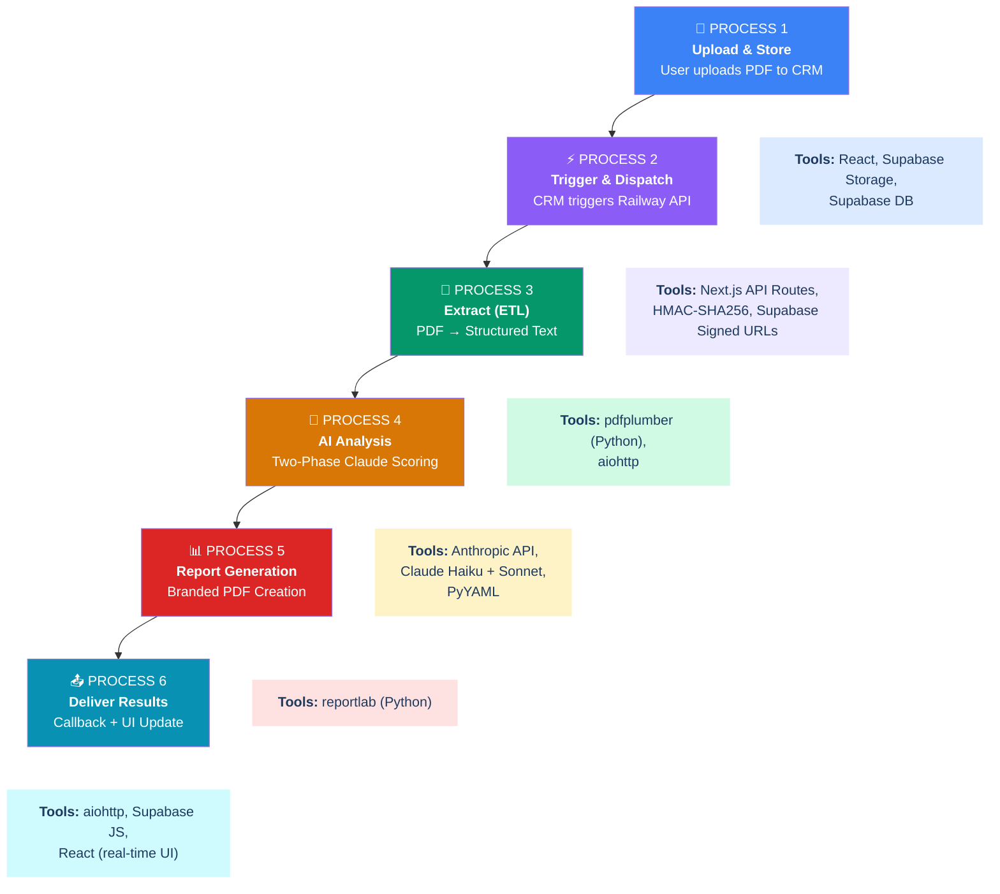
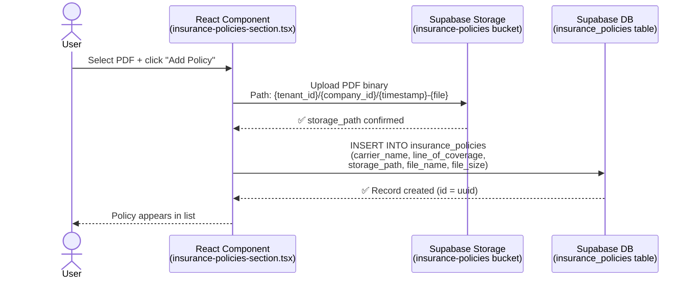
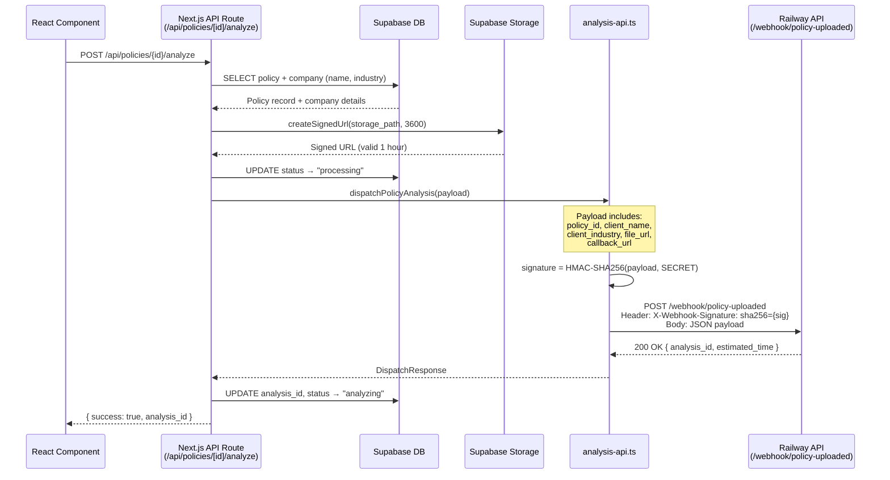
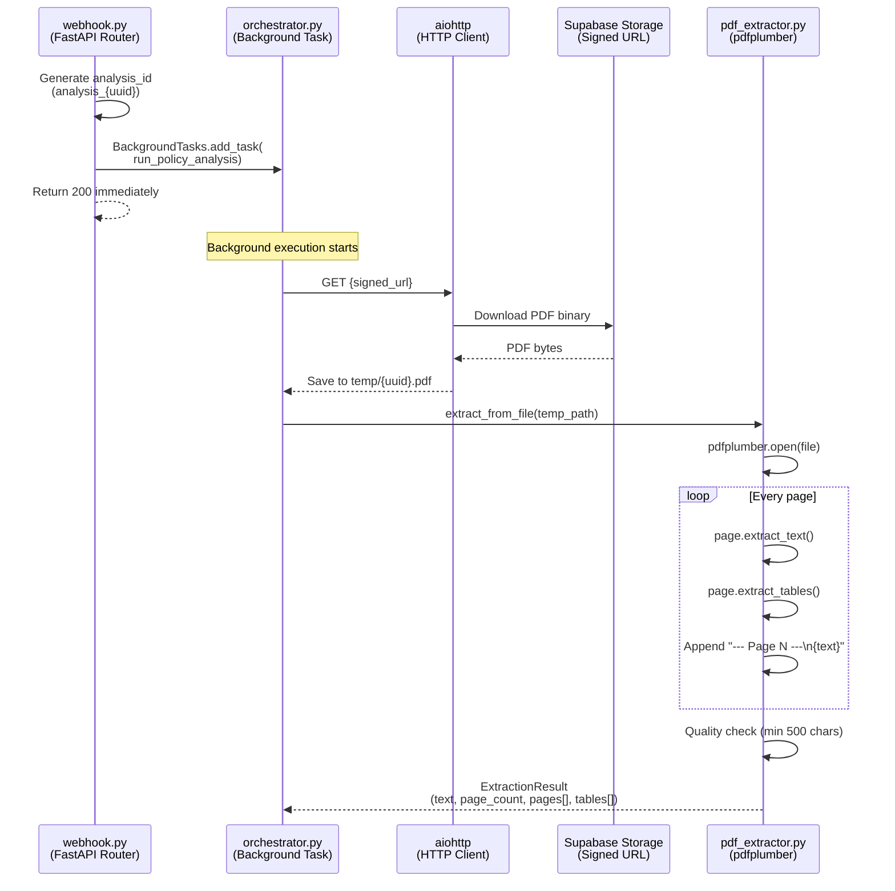
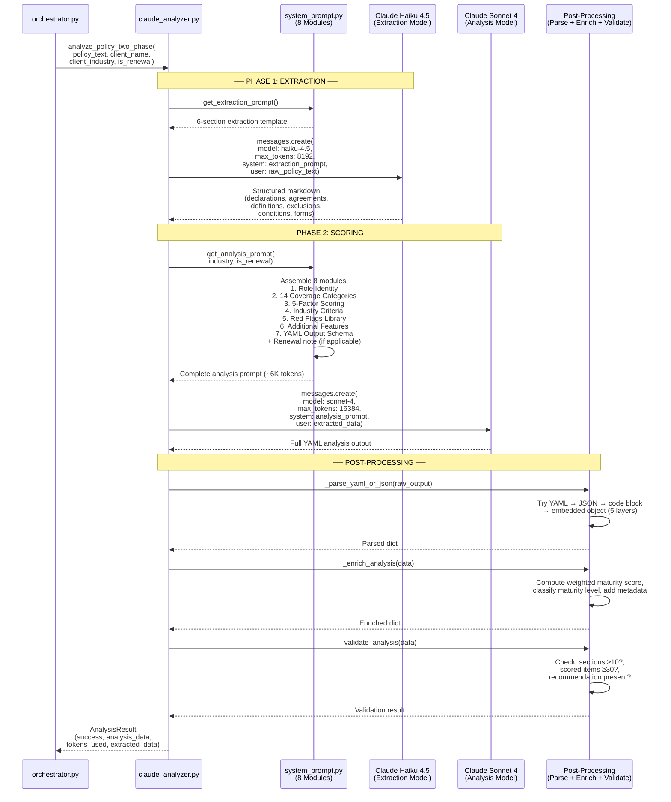
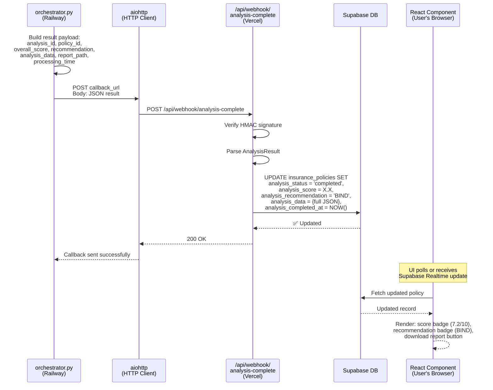

# High-Level Process Flow & Tools Map

**Rhône Risk — Cyber Policy Analysis Pipeline**

---

## End-to-End Pipeline — Master Flow

Six core processes, each with specific tools and technologies. The entire pipeline runs automatically once a user uploads a policy PDF.

### Tool Legend

| Category | Description |
|----------|-------------|
| **Next.js / React** | CRM Frontend (Vercel) |
| **Supabase** | Database + File Storage |
| **Python** | Railway Backend Services |
| **Claude API** | Anthropic AI Models |
| **reportlab** | PDF Report Generation |
| **HTTP / Webhooks** | Service Communication |

---

## Process 1 — Upload & Store

### ① Upload & Store the Policy PDF

**Tools:** `React` · `Supabase Storage` · `Supabase DB (PostgreSQL)`

User selects a PDF in the CRM. The file is uploaded to Supabase Storage and a record is inserted into the `insurance_policies` table with the storage path.

| Tool / Technology | Role in This Process | Runs On |
|-------------------|---------------------|---------|
| **React** `insurance-policies-section.tsx` | Renders upload form, handles file selection, manages UI state | User's browser |
| **Supabase Storage SDK** `@supabase/supabase-js` | Uploads PDF binary to the `insurance-policies` bucket | User's browser → Supabase |
| **Supabase DB** PostgreSQL via JS client | Inserts policy metadata record (carrier, coverage line, file path, etc.) | User's browser → Supabase |

---

## Process 2 — Trigger & Dispatch

### ② Trigger Analysis & Dispatch to Railway

**Tools:** `Next.js API Route` · `Supabase DB` · `Supabase Signed URLs` · `HMAC-SHA256` · `fetch (HTTP POST)`

After upload, the CRM fires a POST to its own API. The API route looks up the policy, generates a time-limited signed URL for the PDF, signs the entire payload with HMAC-SHA256, and sends it to Railway.

| Tool / Technology | Role in This Process | Runs On |
|-------------------|---------------------|---------|
| **Next.js API Route** `/api/policies/[id]/analyze/route.ts` | Server-side route that orchestrates the dispatch: fetches policy, gets signed URL, calls library | Vercel serverless function |
| **Supabase DB** via `@supabase/supabase-js` (service role) | Reads policy + company details, updates `analysis_status` at each stage | Vercel → Supabase |
| **Supabase Storage** `createSignedUrl()` | Generates a 1-hour presigned URL so Railway can download the PDF without direct access | Vercel → Supabase |
| **Node.js `crypto`** (HMAC-SHA256) | Signs the JSON payload so Railway can verify the request is legitimate | Vercel serverless function |
| **fetch** (HTTP POST) | Sends the signed webhook payload to Railway's `/webhook/policy-uploaded` endpoint | Vercel → Railway |
| **analysis-api.ts** | Shared library that wraps signature generation + dispatch + status check into clean functions | Vercel serverless function |

---

## Process 3 — Extract (ETL: PDF → Structured Text)

### ③ Download PDF & Extract Text

**Tools:** `FastAPI` · `aiohttp` · `pdfplumber`

Railway receives the webhook, downloads the PDF from the signed URL, and uses pdfplumber to extract every page's text and tables. The output is structured text with page markers.

| Tool / Technology | Role in This Process | Runs On |
|-------------------|---------------------|---------|
| **FastAPI** `webhook.py` | Receives the HTTP POST, validates payload shape via Pydantic model, queues background task | Railway container |
| **FastAPI BackgroundTasks** | Runs the analysis pipeline asynchronously so the webhook returns immediately (non-blocking) | Railway container |
| **aiohttp** (async HTTP client) | Downloads the PDF from the Supabase signed URL to Railway's local filesystem | Railway → Supabase Storage |
| **pdfplumber** `pdf_extractor.py` | Opens the PDF and extracts text + tables page-by-page with layout preservation. Produces structured text with `--- Page N ---` markers. | Railway container |
| **Pydantic** `PolicyUploadedPayload` | Validates incoming webhook payload structure (required fields, URL format, types) | Railway container |

### Output Format (ExtractionResult)

| Field | Type | Description |
|-------|------|-------------|
| `success` | bool | Whether extraction succeeded |
| `text` | str | All pages joined with `--- Page N ---` markers |
| `page_count` | int | Total number of pages in the PDF |
| `pages` | List[Dict] | Per-page text with page number and char count |
| `tables` | List[Dict] | Extracted tables with page number and row data |

---

## Process 4 — AI Analysis (Two-Phase Claude Scoring)

### ④ Two-Phase Claude AI Analysis

**Tools:** `Claude Haiku 4.5` · `Claude Sonnet 4` · `anthropic SDK` · `PyYAML` · `system_prompt.py (8 modules)`

The extracted text goes through two AI passes. Phase 1 (Haiku) extracts structured data. Phase 2 (Sonnet) applies the full scoring methodology and produces a complete YAML analysis with scores, red flags, and recommendations.

| Tool / Technology | Role in This Process | Runs On |
|-------------------|---------------------|---------|
| **Claude Haiku 4.5** `claude-haiku-4-5-20251001` | **Phase 1 — Data Extraction.** Reads raw PDF text and extracts structured data into clean markdown (declarations, insuring agreements, definitions, exclusions, conditions, schedule of forms). Fast and cost-efficient (~$0.01/call). | Anthropic API |
| **Claude Sonnet 4** `claude-sonnet-4-20250514` | **Phase 2 — Scoring & Analysis.** Takes the clean extraction and applies the full Rhône Risk methodology: 5-factor scoring per item, 5-dimension maturity, red flag detection, industry-specific analysis, binding recommendation. Produces complete YAML output (~$0.15-0.25/call). | Anthropic API |
| **anthropic** Python SDK | API client that sends messages to Claude models and receives responses. Handles authentication, retries, and token counting. | Railway container |
| **system_prompt.py** (8 modules) | Modular prompt assembly system with 3 functions. Modules: Role Identity, Coverage Categories (14), Scoring Methodology (5-factor + 5-dimension), Industry Criteria (8 industries), Red Flags Library (13 flags), Additional Features (10), YAML Output Format (full schema), Few-Shot Example (CNA/FSI truncated). | Railway container |
| **PyYAML** `yaml.safe_load()` | Primary output parser — Claude returns YAML and PyYAML parses it into a Python dictionary. Falls back through 4 additional parsing strategies if YAML fails. | Railway container |
| **json** (stdlib) | Fallback output parser if Claude returns JSON instead of YAML. | Railway container |
| **re** (stdlib) | Regex-based extraction — finds YAML/JSON content inside code fences or embedded objects when standard parsing fails. | Railway container |

### Prompt Module Breakdown (system_prompt.py — 1,186 lines)

| Module | ~Tokens | Purpose | Used In |
|--------|---------|---------|---------|
| `ROLE_IDENTITY` | 220 | Analyst persona and analysis principles | Phase 2 + Single-pass |
| `COVERAGE_CATEGORIES` | 900 | 14 categories with ~60 sub-items to evaluate | Phase 2 + Single-pass |
| `SCORING_METHODOLOGY` | 890 | 5-factor per-item scoring + 5-dimension maturity framework | Phase 2 + Single-pass |
| `INDUSTRY_CRITERIA` | ~500 each | 8 industry-specific modules with heightened scrutiny areas | Phase 2 + Single-pass (one selected) |
| `RED_FLAGS` | 775 | 13 red flags with severity levels and score impact | Phase 2 + Single-pass |
| `ADDITIONAL_FEATURES` | 300 | 10 policy-wide features (prior acts, pay-on-behalf, hammer clause, etc.) | Phase 2 + Single-pass |
| `YAML_OUTPUT_FORMAT` | 2,100 | Complete YAML schema defining exact output structure | Phase 2 + Single-pass |
| `FEW_SHOT_EXAMPLE` | 1,000 | Truncated real CNA/FSI analysis as quality reference | Single-pass only |

---

## Process 5 — Report Generation (Branded PDF)

### ⑤ Generate Branded PDF Report

**Tools:** `reportlab` · `Python (report_generator.py)`

The structured analysis data (YAML/dict) is rendered into a multi-page branded PDF using reportlab. The report includes a cover page, executive summary, coverage tables, red flags, and recommendations — all in Rhône Risk brand colors.

```mermaid
flowchart LR
    A["Analysis Data<br/>(Python dict from<br/>YAML parsing)"] --> B["report_generator.py"]

    subgraph "ReportGenerator Class"
        B --> S1["_create_cover_page()<br/>Logo, client info,<br/>score badge, rec badge"]
        S1 --> S2["_create_executive_summary()<br/>Overview, metrics table,<br/>action items, rationale"]
        S2 --> S3["_create_coverage_analysis()<br/>First-party coverage table,<br/>Third-party coverage table"]
        S3 --> S4["_create_red_flags_section()<br/>HIGH/MEDIUM severity flags,<br/>deficiencies, concerns"]
        S4 --> S5["_create_recommendations()<br/>Immediate actions,<br/>renewal items, risk mgmt"]
    end

    S5 --> C["SimpleDocTemplate.build()"]
    C --> D["📄 {ClientName}_Policy_Analysis_{timestamp}.pdf"]

    style A fill:#d97706,color:#fff
    style D fill:#162B4D,color:#fff
    style S1 fill:#162B4D,color:#fff
    style S4 fill:#DC3545,color:#fff
    style S5 fill:#28A745,color:#fff
```

| Tool / Technology | Role in This Process | Runs On |
|-------------------|---------------------|---------|
| **reportlab** `SimpleDocTemplate` | Core PDF engine — creates the document with page size (US Letter), margins, and page flow | Railway container |
| **reportlab** `Paragraph` | Renders formatted text blocks (titles, body text, bullet points) with custom paragraph styles | Railway container |
| **reportlab** `Table` + `TableStyle` | Creates formatted data tables (key metrics, coverage scores) with Rhône Risk branded styling | Railway container |
| **reportlab** `HRFlowable` | Renders horizontal rules (dividers) between sections in the accent color | Railway container |
| **reportlab** `colors.HexColor` | Defines all Rhône Risk brand colors: Navy (#162B4D), Cyan (#0CBDDB), success/warning/danger | Railway container |
| **Python `os`** | Creates the `reports/` output directory, generates safe filenames from client name + timestamp | Railway container |

---

## Process 6 — Deliver Results (Callback + UI Update)

### ⑥ Send Results Back & Update UI

**Tools:** `aiohttp (HTTP POST)` · `Next.js Webhook Route` · `HMAC-SHA256 Verification` · `Supabase DB` · `React (UI refresh)`

Railway sends the complete results (score, recommendation, full analysis data, report path) back to the CRM's webhook endpoint. The CRM verifies the signature, saves everything to Supabase, and the UI refreshes to show the score badge and recommendation.

| Tool / Technology | Role in This Process | Runs On |
|-------------------|---------------------|---------|
| **aiohttp** `_send_callback()` | Sends the full analysis result as an HTTP POST to the CRM's callback URL with a 30-second timeout | Railway → Vercel |
| **Next.js API Route** `/api/webhook/analysis-complete/route.ts` | Receives the callback, verifies HMAC signature, parses the result, and writes to Supabase | Vercel serverless function |
| **Node.js `crypto`** `verifySignature()` | Validates the incoming callback's HMAC-SHA256 signature using timing-safe comparison | Vercel serverless function |
| **Supabase DB** `.update()` | Writes final results to the `insurance_policies` record: score, recommendation, full analysis JSON, completion timestamp | Vercel → Supabase |
| **React** (UI refresh) | User sees updated policy card with color-coded maturity score badge and recommendation label | User's browser |

---

## Summary — All Tools by Process

| Process | Tools Used | Runs On | Duration |
|---------|-----------|---------|----------|
| **1. Upload & Store** | React, Supabase Storage, Supabase DB | Browser + Supabase | 2-5 seconds |
| **2. Trigger & Dispatch** | Next.js Route, Supabase DB, Signed URLs, HMAC-SHA256, fetch, analysis-api.ts | Vercel → Railway | 1-3 seconds |
| **3. Extract (ETL)** | FastAPI, aiohttp, pdfplumber, Pydantic | Railway | 5-15 seconds |
| **4. AI Analysis** | Claude Haiku 4.5, Claude Sonnet 4, anthropic SDK, system_prompt.py, PyYAML | Railway → Anthropic | 40-110 seconds |
| **5. Report Gen** | reportlab, Python (os, datetime) | Railway | 3-8 seconds |
| **6. Deliver Results** | aiohttp, Next.js Route, HMAC verify, Supabase DB, React | Railway → Vercel → Supabase | 1-2 seconds |
| **TOTAL** | **15 distinct tools/technologies across 3 services** | | **~52-143 seconds** |

---

*Rhône Risk Advisory — Process Flow & Tools Map*
*February 2026 — Confidential*
